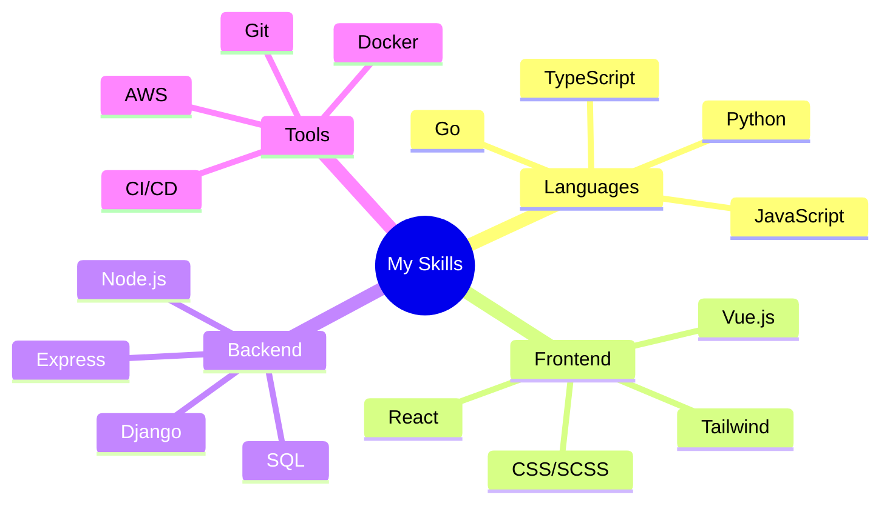

# 👋 Hello, World! I'm Light

  

  

## 💫 About Me

> *"Quote that represents your philosophy or approach to coding"*

I'm a passionate [Your Role] based in [Your Location], focusing on [Your Specialties]. With [X years] of experience, I enjoy tackling complex problems and turning ideas into elegant solutions.

- 🔭 I'm currently working on **[Project Name]**
- 🌱 I'm currently learning **[Technology/Framework]**
- 👯 I'm looking to collaborate on **[Type of Projects]**
- 💬 Ask me about **[Your Expertise Areas]**
- ⚡ Fun fact: **[Something Interesting About You]**

## 🚀 Skills & Technologies

  

## 📊 GitHub Stats

  
  

## 🔥 Streak Stats

  

## 📌 Pinned Projects

  
  

  
  

## 🏆 GitHub Trophies

  

## 📈 Contribution Graph

  

## ⚡ Recent Activity

<!--START_SECTION:activity-->
1. 🎉 Merged PR [#42](https://github.com/yourusername/repo) in [yourusername/repo]
2. 💪 Opened PR [#123](https://github.com/yourusername/repo) in [yourusername/repo]
3. 🗣 Commented on [#15](https://github.com/yourusername/repo) in [yourusername/repo]
4. 🐛 Fixed bug [#7](https://github.com/yourusername/repo) in [yourusername/repo]
<!--END_SECTION:activity-->

## 🎧 Now Playing

  

## 📝 Latest Blog Posts

<!-- BLOG-POST-LIST:START -->
- [Title of your first blog post](https://your-blog.com/post1)
- [Title of your second blog post](https://your-blog.com/post2)
- [Title of your third blog post](https://your-blog.com/post3)
<!-- BLOG-POST-LIST:END -->

## 📫 How to reach me

|  |  |  |
|:---:|:---:|:---:|
| your-email@example.com | [LinkedIn](https://linkedin.com/in/yourusername) | [Twitter](https://twitter.com/yourusername) |

## 🌐 Visitors Count

  

---

  
   
  <i>Thanks for visiting my profile! Let's connect and build amazing things together.</i>

