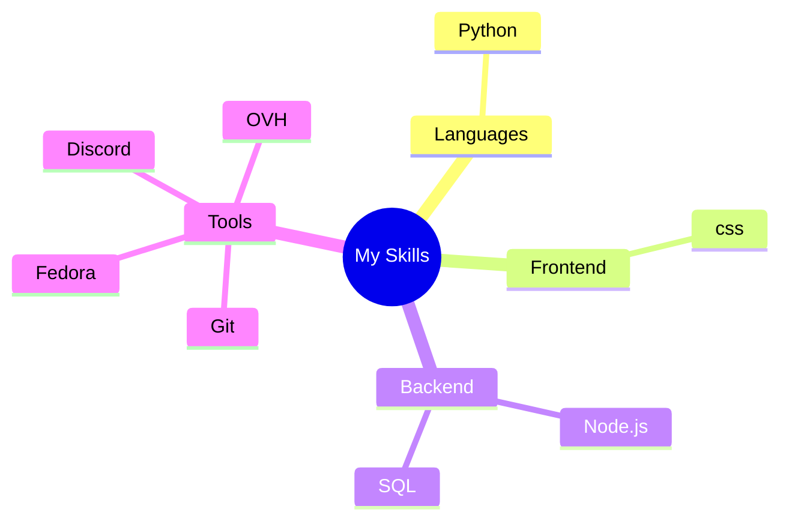

# 👋 Hello, World! I'm LightZirconite

  
  
Developer | Creator | Innovator

  
  

  

## 💫 About Me

> *"Light Zirconite"*

I'm a computer enthusiast based in Senlis, FR, specializing in Linux. With 3 years of experience, I enjoy tackling complex problems and transforming ideas into elegant solutions.

## 🚀 Skills & Technologies

  

  

## 📊 GitHub Stats

  
  

## 🔥 Streak Stats

  

## 📌 Pinned Projects

  
  

  
  

## 🏆 GitHub Trophies

  

## 📈 Contribution Graph

  

## 🎧 Currently Listening To

  

## 📫 How to reach me

|  |
|:---:|
| [Discord](https://discord.com/users/683712256243925066) |

## 🌐 Visitors Count

  

  

---

  
   
  <i>Thanks for visiting my profile! Let's connect and build amazing things together.</i>

